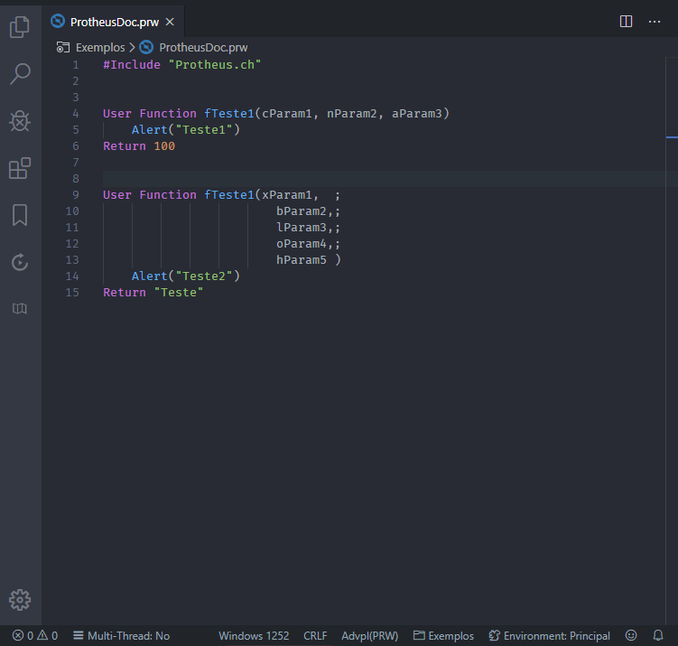

   

# ProtheusDoc for VsCode (AdvPL)

Suporte aos recursos e snippets de documentação TOTVS ProtheusDoc para VsCode.

**Estou muito feliz pelo seu Download e espero que goste!**

---

## Necessidade

Detectar a sintaxe da função, método ou classe e gerar uma documentação dinâmica no formato [ProtheusDoc.](https://tdn.totvs.com/display/tec/ProtheusDOC)

Conheça mais sobre o ProtheusDoc em meu blog: https://gabrielalencar.dev/2020/01/29/ProtheusDoc-for-VsCode/

## [Issues](https://github.com/AlencarGabriel/ProtheusDoc-VsCode/issues)

Caso encontre algum problema, tenha alguma dúvida ou sugestão de melhoria, fique a vontade para abrir uma Issue ou enviar um Pull Request.

## [Wiki](https://github.com/AlencarGabriel/ProtheusDoc-VsCode/wiki)

Acesse a Wiki para conhecer os recursos, comandos e atalhos da extensão. Lá você encontrará dicas e instruções para configurá-la no seu ambiente, e desfrutar dos recursos da melhor forma.

## Features previstas:

- [x] Implementar geração do cabeçalho lendo a declaração da Função;
- [x] Implementar configuração para o nome do Autor Default (caso omitido apresenta o do SO);
- [x] Implementar configuração para ocultar marcadores não obrigatórios;
- [x] Implementar Snippets dos marcadores mais comuns do ProtheusDoc;
- [x] Implementar geração do cabeçalho lendo a declaração do Método;
- [x] Implementar geração do cabeçalho lendo a declaração da Classe;
- [x] Implementar *Text Decoration* para os atributos do ProtheusDoc ficarem negritos;
- [x] Implementar *Hover de Documentação* nas chamadas dos identificadores para mostrar o ProtheusDOC;
- [x] Implementar geração de HTML das documentações (Será necessário apoio da comunidade);
- [ ] Implementar função para criar comentários no cabeçalho de todas as funções do fonte;
- [ ] Implementar sintaxe do 4gl (Será necessário apoio da comunidade);

---

## Comandos da Extensão

Veja mais na Wiki [Comandos](https://github.com/AlencarGabriel/ProtheusDoc-VsCode/wiki/Comandos).

---

## Hover de documentações

Veja mais na Wiki [Hover de documentações](https://github.com/AlencarGabriel/ProtheusDoc-VsCode/wiki/Hover-de-documentações).

---

## Documentação HTML

Veja mais na Wiki [Documentação HTML](https://github.com/AlencarGabriel/ProtheusDoc-VsCode/wiki/Documentação-HTML)

---

## Tabela de documentações

A tabela de documentações armazena uma lista de documentações ProtheusDoc detectadas na Workspace ou nos arquivos abertos.

Veja mais na Wiki [Tabela de documentações](https://github.com/AlencarGabriel/ProtheusDoc-VsCode/wiki/Tabela-de-documentações).

---

## Configurações da extensão e valores default

Veja na Wiki [Configurações](https://github.com/AlencarGabriel/ProtheusDoc-VsCode/wiki/Configurações).

---

**Aproveite, me ajuda e com certeza irá te ajudar também!** :heart:
