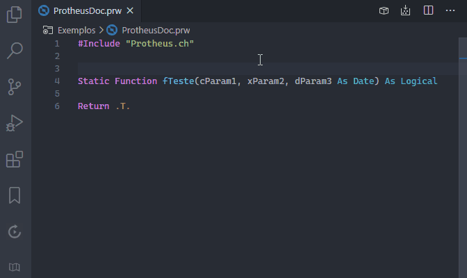

        

# ProtheusDoc for VsCode (AdvPL)

Suporte aos recursos e snippets de documentação TOTVS ProtheusDoc para VsCode.

*Theme: [Atom One Dark](https://marketplace.visualstudio.com/items/akamud.vscode-theme-onedark)*

**Estou muito feliz pelo seu Download e espero que goste!**

---

## Descrição

Esta extensão irá detectar a sintaxe de uma **função**, **método** ou **classe** e gerar uma documentação dinâmica no formato [ProtheusDoc.](https://tdn.totvs.com/display/tec/ProtheusDOC)

Conheça mais sobre o ProtheusDoc neste post: https://gabrielalencar.dev/2020/01/29/ProtheusDoc-for-VsCode/

Confira este post especial em comemoração a marca de **3k users**: https://github.com/AlencarGabriel/ProtheusDoc-VsCode/discussions/48

## [Issues](https://github.com/AlencarGabriel/ProtheusDoc-VsCode/issues)

Caso encontre algum **problema**, tenha alguma **dúvida** ou sugestão de **melhoria**, fique a vontade para abrir uma Issue ou enviar um Pull Request com sua implementação.

## [Wiki](https://github.com/AlencarGabriel/ProtheusDoc-VsCode/wiki)

Acesse a Wiki para conhecer os recursos, comandos e atalhos da extensão. Lá você encontrará dicas e instruções para configurá-la no seu ambiente, e desfrutar dos recursos da melhor forma.

## Features previstas:

- [x] Implementar geração do cabeçalho lendo a declaração da Função;
- [x] Implementar configuração para o nome do Autor Default (caso omitido apresenta o do SO);
- [x] Implementar configuração para ocultar marcadores não obrigatórios;
- [x] Implementar Snippets dos marcadores mais comuns do ProtheusDoc;
- [x] Implementar geração do cabeçalho lendo a declaração do Método;
- [x] Implementar geração do cabeçalho lendo a declaração da Classe;
- [x] Implementar *Text Decoration* para os atributos do ProtheusDoc ficarem negritos;
- [x] Implementar *Hover de Documentação* nas chamadas dos identificadores para mostrar o ProtheusDOC;
- [x] Implementar geração de HTML das documentações (Será necessário apoio da comunidade);
- [x] Implementar *Diagnóstico* da sintaxe e de valores preenchidos dos principais atributos ProtheusDoc;
- [x] Adicionar no IntelliSense todas as **palavras/words** do editor aberto;
- [ ] Implementar função para criar comentários no cabeçalho de todas as funções do fonte;
- Outras solicitações de melhorias pendentes: [Veja aqui](https://github.com/AlencarGabriel/ProtheusDoc-VsCode/issues?q=is:issue+is:open+label:enhancement) 
<!-- - [ ] Implementar sintaxe do 4gl (Será necessário apoio da comunidade); -->

---

## Comandos & Atalhos da Extensão
#### A extensão disponibiliza vários comandos, itens de contexto e alguns atalhos para utilização dos recursos implementados.

- Saiba mais na Wiki: [Comandos](https://github.com/AlencarGabriel/ProtheusDoc-VsCode/wiki/Comandos).

---

## Hover de documentações
#### Ao passar o mouse sobre uma **função**, **método** ou **classe**, um hover apresentará os dados das documentações ProtheusDoc presentes na [tabela de documentações](#tabela-de-documentações):

*Theme: [Atom One Dark](https://marketplace.visualstudio.com/items/akamud.vscode-theme-onedark)*

- Saiba mais na Wiki: [Hover de documentações](https://github.com/AlencarGabriel/ProtheusDoc-VsCode/wiki/Hover-de-documentações).

---

## Documentação HTML
#### Com essa extensão é possível exportar as documentações ProtheusDoc para HTML.
- Saiba mais na Wiki: [Documentação HTML](https://github.com/AlencarGabriel/ProtheusDoc-VsCode/wiki/Documentação-HTML)

---

## Tabela de documentações
#### A tabela de documentações armazena uma lista de documentações ProtheusDoc detectadas na Workspace ou nos arquivos abertos.

- Saiba mais na Wiki: [Tabela de documentações](https://github.com/AlencarGabriel/ProtheusDoc-VsCode/wiki/Tabela-de-documentações).

---

## Configurações da extensão e valores default
#### A extensão disponibiliza uma série de configurações especiais, inclusive permite alterar os valores default de alguns atributos do ProtheusDoc.

- Saiba mais na Wiki: [Configurações](https://github.com/AlencarGabriel/ProtheusDoc-VsCode/wiki/Configurações).

---

## Diagnóstico das documentações ProtheusDoc
#### As documentações ProtheusDoc devem seguir uma convenção padrão da TOTVS, por isso é disponibilizado um "validador" para diagnisticar as documentações.

- Saiba mais na Wiki: [Diagnóstico das documentações](https://github.com/AlencarGabriel/ProtheusDoc-VsCode/wiki/Diagnóstico-das-documentações).

---

**Aproveite, me ajuda e com certeza irá te ajudar também!** :heart:

---

> Esta extensão **foi criada e é mantida pela comunidade**. Não tem nenhum vínculo direto ou indireto com a TOTVS®, qualquer uma de suas franquias ou qualquer um de seus representantes. **ProtheusDoc** é uma convenção criada e mantida pela TOTVS®. Esta extensão tem como objetivo apenas prover recursos que facilitem o uso desta convenção.
